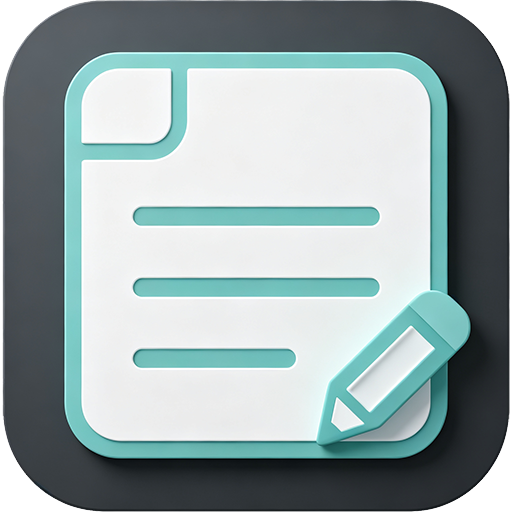
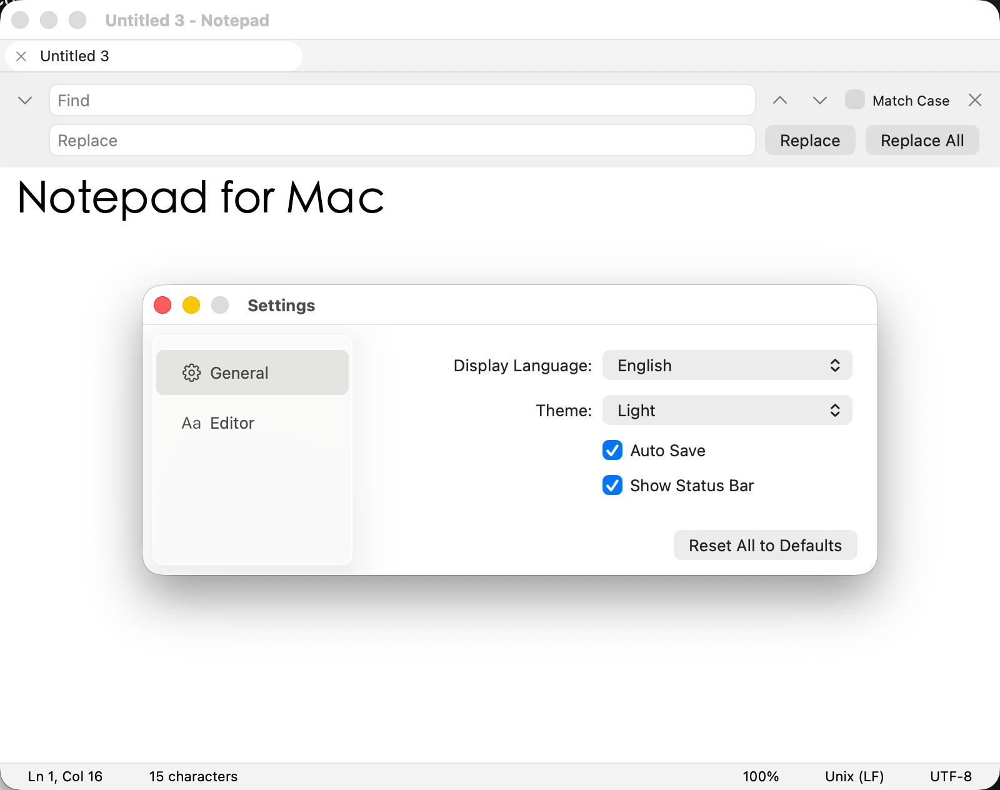
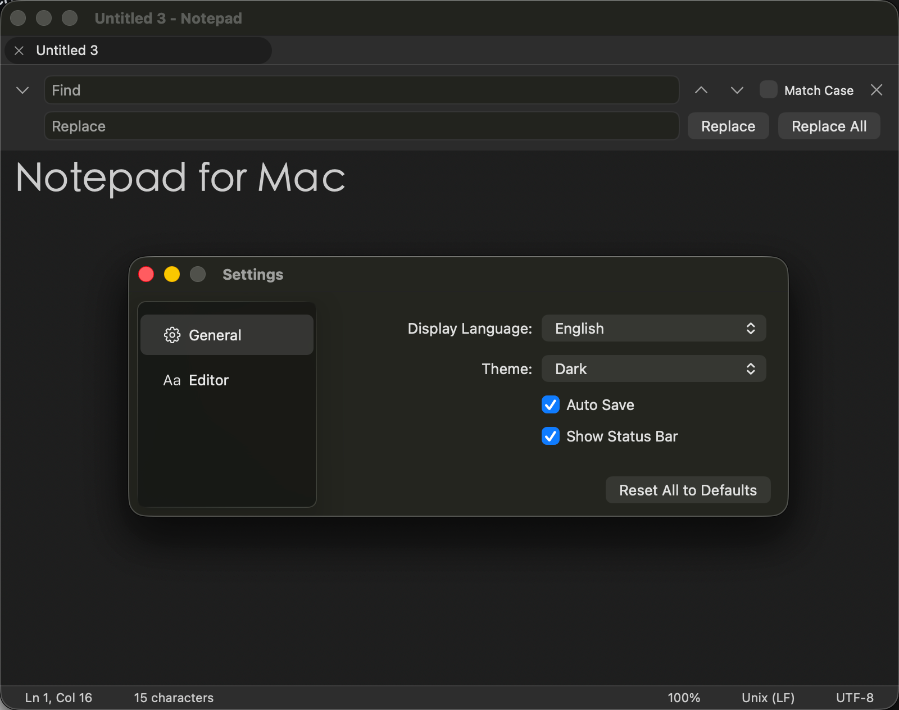

<p align="center">
  
</p>
<h1 align="center">Notepad for Mac</h1>

<p align="center">
  A native macOS text editor that faithfully replicates the <strong>Windows 11 Notepad</strong> experience.
</p>

<p align="center">
  
  
  
  
  <!-- TODO: 建仓后把下面两个徽章中的 OWNER 替换为实际 GitHub 用户名 -->
  
  
</p>

<p align="center">
  <a href="README.md">English</a> · <a href="README.zh-CN.md">简体中文</a>
</p>

Built 100% with native **AppKit** (no Electron, no WebViews) on top of `NSDocument` and `NSTextView`.
A single **Universal Binary** runs on both Apple Silicon and Intel Macs.

## Screenshots

<!-- TODO: 将截图放入 docs/screenshots/ 并替换下方占位（浅色/深色主窗口、查找栏、多标签、编码菜单） -->

| Light | Dark |
| :---: | :---: |
|  |  |

## Features

- **Windows 11 Notepad replica** — familiar window/tab model, status bar layout and keyboard shortcuts for users coming from Windows.
- **Multi-tab editing** — drag tabs to reorder, drag a tab out to tear it into a new window, unsaved-dot indicator, right-click menu (Close / Close Others / Close to the Right / Duplicate Tab / Reveal in Finder).
- **Encoding support** — UTF-8, UTF-16 LE/BE, UTF-32 LE/BE (with or without BOM), GB18030 (GBK/GB2312), Big5 and Windows-1252. Auto-detected on open (BOM + content heuristics) and switchable from the status bar.
- **Line endings** — LF / CRLF / CR detected automatically, convert with one click.
- **Find & Replace** — default case-insensitive (Windows 11 behavior), wrap-around, regular expressions, replace-all with a count, and Win11-style yellow/orange match highlighting.
- **Auto-save & crash recovery** — session backups throttled to ≤ 1s; after a crash your tabs, content and cursor position are restored on next launch (lose at most 1 second of typing).
- **Large file handling** — files over 10 MB open read-only after a prompt, so your Mac never hangs.
- **Print** — page setup and printing with centered filename header and "Page X of Y" footer.
- **Touch Bar** support and **Shortcuts app** actions (macOS 13+).
- **Trilingual UI** — English, Simplified Chinese, Traditional Chinese.
- **Light & dark themes** — follows the system appearance.
- **Zoom 10%–500%**, word wrap, system font panel, go-to-line, F5 timestamp insert.
- **macOS Services integration** — "New Notepad Window with Text" service for selected text anywhere in the system.

## Requirements

- macOS 12.0 or later
- Apple Silicon or Intel (Universal Binary)

## Installation

### Download (GitHub Releases)

Grab the latest `Notepad-*.dmg` from the [Releases](../../releases) page.
The build is currently **unsigned** (no Apple Developer certificate yet), so on first launch:

1. **Right-click** `Notepad.app` → **Open**, then confirm **Open** in the dialog.
2. Or: `xattr -dr com.apple.quarantine Notepad.app` in Terminal.

### Build from source

```bash
# 1. Generate the Xcode project (requires XcodeGen; installs it via Homebrew if missing)
./Scripts/setup.sh

# 2. Build (Debug) / test
make build
make test

# 3. No Xcode? Build with the bundled swiftc script instead:
./Scripts/dev-build.sh    # → build/Notepad.app (ad-hoc signed, for local use)
```

## Keyboard Shortcuts

| Shortcut | Action |
| --- | --- |
| `⌘N` | New tab |
| `⇧⌘N` | New window |
| `⌘O` / `⌘S` / `⇧⌘S` | Open / Save / Save As |
| `⌘W` / `⇧⌘W` | Close tab / Close window |
| `⌘F` / `⌥⌘F` | Find / Replace |
| `⌘G` / `⇧⌘G` | Find next / Find previous |
| `⌃G` | Go to line |
| `⇧⌘]` / `⇧⌘[` | Next / Previous tab |
| `⌥⌘W` | Toggle word wrap |
| `⌘+` / `⌘-` / `⌘0` | Zoom in / Zoom out / Reset zoom |
| `⌘/` | Toggle status bar |
| `F5` | Insert date & time |

## Encodings & Line Endings

| Encoding | Auto-detect | Save |
| --- | :---: | :---: |
| UTF-8 (with/without BOM) | ✅ | ✅ |
| UTF-16 LE / BE | ✅ | ✅ |
| UTF-32 LE / BE | ✅ | ✅ |
| GB18030 (GBK/GB2312) | ✅ | ✅ |
| Big5 | ✅ | ✅ |
| Windows-1252 | ✅ | ✅ |

| Line ending | Auto-detect | Convert |
| --- | :---: | :---: |
| LF (`\n`) | ✅ | ✅ |
| CRLF (`\r\n`) | ✅ | ✅ |
| CR (`\r`) | ✅ | ✅ |

## Project Structure

```
Notepad/
├── App/            # App lifecycle, main menu, document controller
├── Document/       # NSDocument, encoding & line-ending managers
├── Editor/         # Text view, find & replace, go-to-line
├── UI/             # Tab bar, status bar, find bar, theme
├── Preferences/    # Persisted preferences
├── Services/       # Print, backup, shortcuts, updates, crash reporting
├── Utilities/      # Constants, helpers, extensions
└── Resources/      # Localizations (en / zh-Hans / zh-Hant), app icon
```

Technical decisions, API contracts, UI design and release procedures are documented (in Chinese) in [`Docs/Specs/`](Docs/Specs/) — `01_TECH_SPEC.md` through `08_KIMI_INSTRUCTION.md`, plus `PRD_Notepad_macOS.md`.

## Development

```bash
make build    # xcodebuild Debug
make test     # unit + UI tests
make lint     # SwiftLint
make format   # SwiftFormat
make release  # unsigned DMG (Scripts/release.sh --unsigned)
```

See [CONTRIBUTING.md](CONTRIBUTING.md) for coding conventions and the PR workflow.

## License

[MIT](LICENSE) © 2026 Notepad for Mac Contributors
