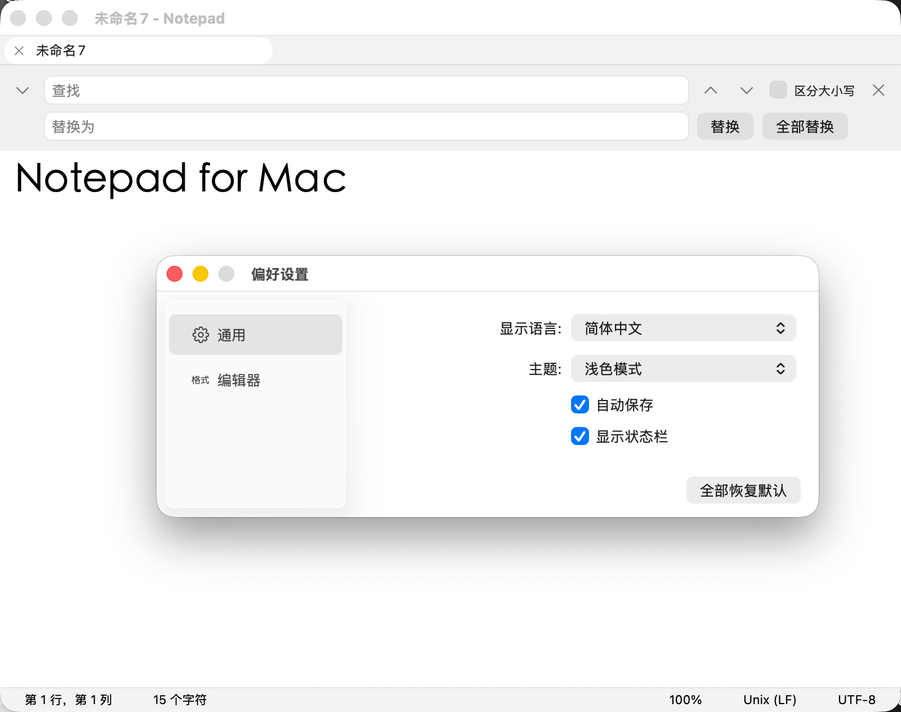
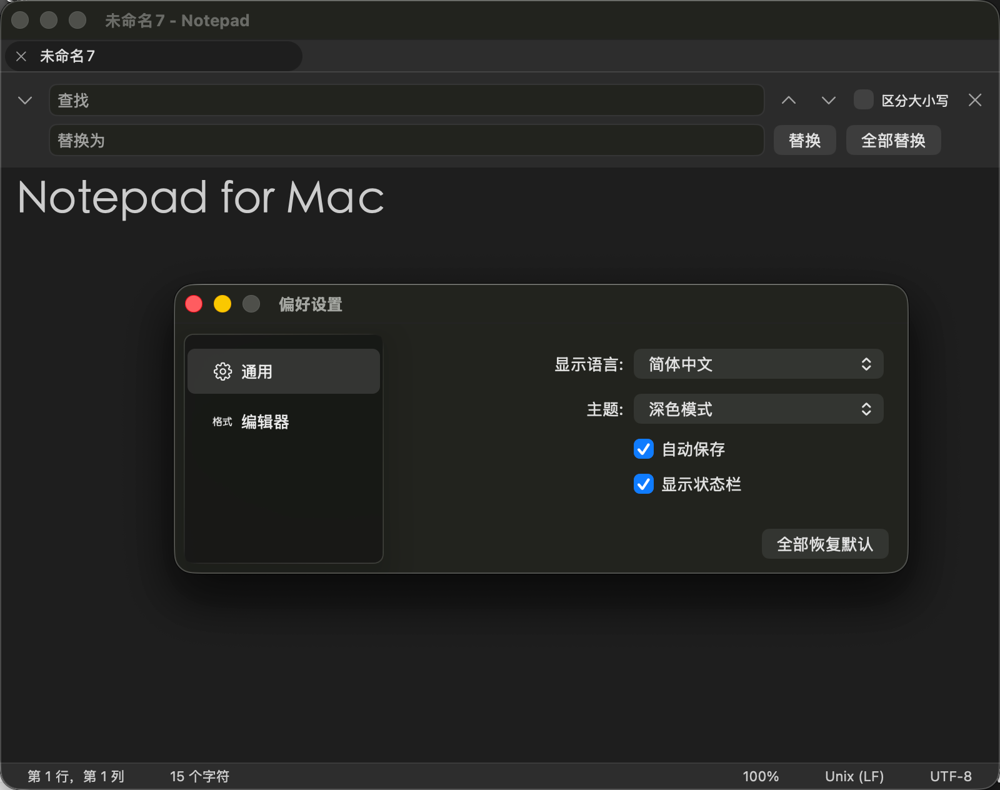

<p align="center">
  
</p>
<h1 align="center">Notepad for Mac</h1>

<p align="center">
  原生 macOS 文本编辑器，1:1 复刻 <strong>Windows 11 记事本</strong>的使用体验。
</p>

<p align="center">
  
  
  
  
  <!-- TODO: 建仓后把下面两个徽章中的 OWNER 替换为实际 GitHub 用户名 -->
  
  
</p>

<p align="center">
  <a href="README.md">English</a> · <a href="README.zh-CN.md">简体中文</a>
</p>

100% 原生 **AppKit** 构建（无 Electron、无 WebView），基于 `NSDocument` 与 `NSTextView`。
单个 **Universal Binary** 同时支持 Apple Silicon 与 Intel。

## 截图

<!-- TODO: 将截图放入 docs/screenshots/ 并替换下方占位（浅色/深色主窗口、查找栏、多标签、编码菜单） -->

| 浅色模式 | 深色模式 |
| :---: | :---: |
|  |  |

## 功能特性

- **复刻 Windows 11 记事本**——熟悉的窗口/标签模型、状态栏布局与快捷键，Windows 用户零学习成本迁移。
- **多标签页**——拖拽排序、拖出标签撕成新窗口、未保存圆点提示、右键菜单（关闭/关闭其他/关闭右侧/复制标签/在 Finder 中显示）。
- **编码支持**——UTF-8、UTF-16 LE/BE、UTF-32 LE/BE（带/不带 BOM）、GB18030（GBK/GB2312 超集）、Big5、Windows-1252；打开时自动检测（BOM + 内容启发式），状态栏一键切换。
- **换行符**——LF / CRLF / CR 自动识别，一键转换。
- **查找与替换**——默认不区分大小写（对齐 Win11）、回绕查找、正则表达式、全部替换并统计数量、Win11 风格黄底/橙色当前项高亮。
- **自动保存与崩溃恢复**——会话备份 ≤1s 节流写入；崩溃后重启恢复全部标签、内容与光标位置（最多丢失 1 秒输入）。
- **大文件处理**——超过 10MB 提示后以只读模式打开，不卡死。
- **打印**——页面设置 + 打印，页眉居中文件名、页脚"第 X 页 共 Y 页"。
- **触控栏**支持、**快捷指令** App 动作（macOS 13+）。
- **三语界面**——简体中文、繁体中文、English。
- **浅色/深色主题**——跟随系统外观。
- **缩放 10%–500%**、自动换行、系统字体面板、转到行、F5 插入日期时间。
- **macOS 服务集成**——任意应用选中文字 → 服务菜单"用所选文字新建文档"。

## 系统要求

- macOS 12.0 及以上
- Apple Silicon 或 Intel（Universal Binary）

## 安装

### 下载（GitHub Releases）

从 [Releases](../../releases) 页面下载最新的 `Notepad-*.dmg`。
当前构建**未签名**（尚未配置 Apple Developer 证书），首次打开时：

1. 右键 `Notepad.app` → **打开**，在弹窗中确认**打开**。
2. 或终端执行：`xattr -dr com.apple.quarantine Notepad.app`

### 从源码构建

```bash
# 1. 生成 Xcode 工程（需 XcodeGen，缺失时自动通过 Homebrew 安装）
./Scripts/setup.sh

# 2. 构建（Debug）/ 测试
make build
make test

# 3. 无 Xcode 环境？用内置 swiftc 脚本直接构建：
./Scripts/dev-build.sh    # → build/Notepad.app（ad-hoc 签名，仅本机使用）
```

## 快捷键

| 快捷键 | 功能 |
| --- | --- |
| `⌘N` | 新建标签页 |
| `⇧⌘N` | 新建窗口 |
| `⌘O` / `⌘S` / `⇧⌘S` | 打开 / 保存 / 另存为 |
| `⌘W` / `⇧⌘W` | 关闭标签页 / 关闭窗口 |
| `⌘F` / `⌥⌘F` | 查找 / 替换 |
| `⌘G` / `⇧⌘G` | 查找下一个 / 上一个 |
| `⌃G` | 转到行 |
| `⇧⌘]` / `⇧⌘[` | 下一个 / 上一个标签页 |
| `⌥⌘W` | 自动换行开关 |
| `⌘+` / `⌘-` / `⌘0` | 放大 / 缩小 / 重置缩放 |
| `⌘/` | 状态栏开关 |
| `F5` | 插入日期与时间 |

## 编码与换行符

| 编码 | 自动检测 | 保存 |
| --- | :---: | :---: |
| UTF-8（带/不带 BOM） | ✅ | ✅ |
| UTF-16 LE / BE | ✅ | ✅ |
| UTF-32 LE / BE | ✅ | ✅ |
| GB18030（GBK/GB2312） | ✅ | ✅ |
| Big5 | ✅ | ✅ |
| Windows-1252 | ✅ | ✅ |

| 换行符 | 自动识别 | 转换 |
| --- | :---: | :---: |
| LF（`\n`） | ✅ | ✅ |
| CRLF（`\r\n`） | ✅ | ✅ |
| CR（`\r`） | ✅ | ✅ |

## 项目结构

```
Notepad/
├── App/            # 应用生命周期、主菜单、文档控制器
├── Document/       # NSDocument、编码与换行符管理器
├── Editor/         # 文本视图、查找替换、转到行
├── UI/             # 标签栏、状态栏、查找栏、主题
├── Preferences/    # 偏好设置持久化
├── Services/       # 打印、备份、快捷指令、更新、崩溃上报
├── Utilities/      # 常量、辅助、扩展
└── Resources/      # 本地化（en / zh-Hans / zh-Hant）、应用图标
```

技术决策、接口契约、UI 设计与发布流程详见仓库 [`Docs/Specs/`](Docs/Specs/)（中文）——`01_TECH_SPEC.md` ~ `08_KIMI_INSTRUCTION.md` 及 `PRD_Notepad_macOS.md`。

## 开发

```bash
make build    # xcodebuild Debug
make test     # 单元 + UI 测试
make lint     # SwiftLint
make format   # SwiftFormat
make release  # 未签名 DMG（Scripts/release.sh --unsigned）
```

编码规范与 PR 流程见 [CONTRIBUTING.md](CONTRIBUTING.md)。

## 许可证

[MIT](LICENSE) © 2026 Notepad for Mac Contributors
